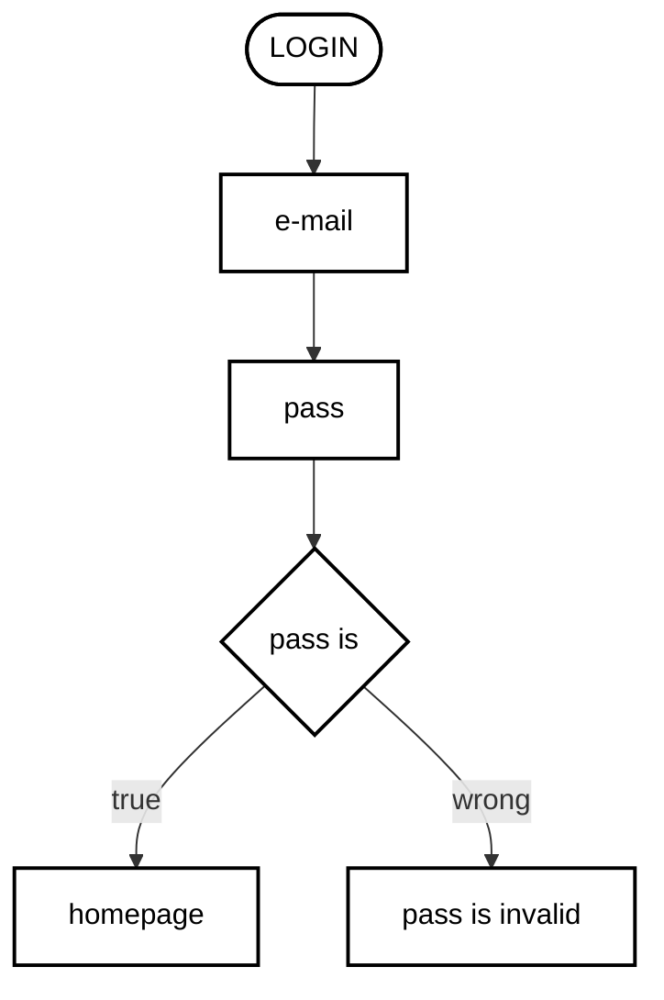
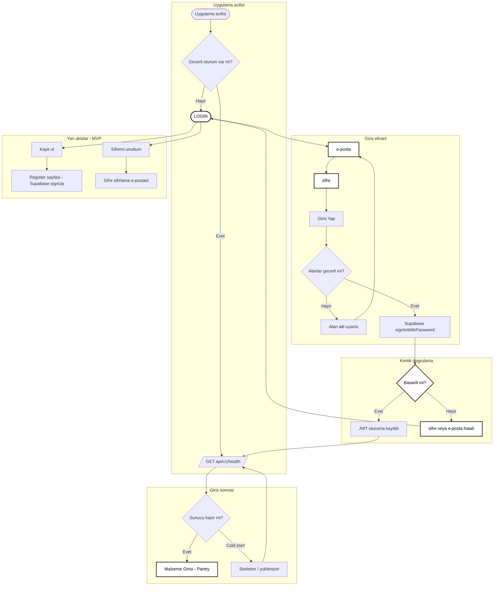

# Giriş Akışı (Login Flow)

**Proje:** Son Çağrı  
**Kaynak:** [MVP_Kapsam_Dokumani.md](./MVP_Kapsam_Dokumani.md) §2 (Auth), [design-system.md](./design-system.md)

---

## 1. Minimal akış (referans)

Kullanıcı şablonu — siyah-beyaz stil:

> **Not:** MVP’de `homepage` = **Malzeme Girişi** (`/pantry`). Şifre doğrulaması istemcide değil **Supabase Auth** üzerinden yapılır.

---

## 2. Genişletilmiş MVP akışı

---

## 3. Kullanıcı mesajları (design-system tonu)

| Durum | UI metni |
|--------|----------|
| Geçersiz kimlik (`invalid_credentials`) | E-posta veya şifre eşleşmedi. Tekrar dene. |
| Boş alan (istemci) | E-posta ve şifre gerekli. |
| Geçersiz e-posta formatı | Geçerli bir e-posta adresi gir. |
| Ağ / sunucu hatası | Bağlantı kurulamadı. Biraz sonra tekrar dene. |
| Kayıt başarılı | Hesabın hazır. Giriş yapabilirsin. |
| Şifre sıfırlama gönderildi | Sıfırlama bağlantısı e-postana gönderildi. |

---

## 4. İlgili dosyalar

| Dosya | Açıklama |
|--------|----------|
| `frontend/src/pages/LoginPage.jsx` | Giriş formu |
| `frontend/src/hooks/useAuth.js` | Supabase oturum |
| `frontend/src/hooks/useBackendReady.js` | Health / cold start |
| `backend/main.py` | `GET /api/v1/health` |
