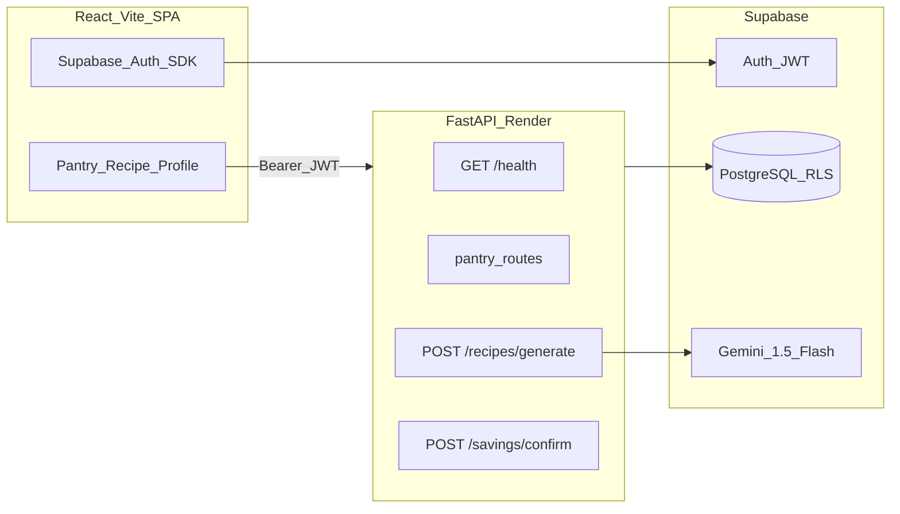
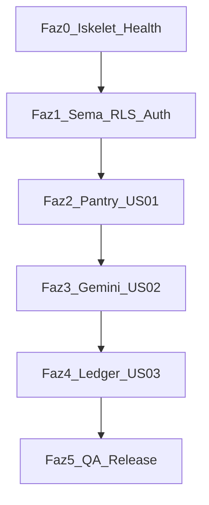

# Son Çağrı — Faz 1 MVP Geliştirme Planı

**Sürüm:** v1.0  
**Durum:** Onay bekliyor  
**Kaynaklar:** [PRD_SON_CAGRİ.md](./PRD_SON_CAGRİ.md) · [MVP_Kapsam_Dokumani.md](./MVP_Kapsam_Dokumani.md) · [fastapi-guide.md](./fastapi-guide.md) · [react-guide.md](./react-guide.md) · [design-system.md](./design-system.md)  
**Hedef süre:** ~6 hafta (Time-to-Market)

---

## Özet

Sıfırdan başlayan Son Çağrı (Project LastCall) reposu için PRD/MVP kapsamına uygun fazlı geliştirme planı: Supabase şema + RLS, FastAPI gateway, React/Vite istemci ve Gemini çekirdek akışı (**kiler → tarif → tasarruf ledger**).

### Yapılacaklar özeti

- [ ] **Faz 0:** backend/frontend iskelet, health, design-system CSS, useBackendReady, README
- [ ] **Faz 1:** Supabase migration (3 tablo + RLS + seed), Auth sayfaları, JWT Depends
- [ ] **Faz 2:** Pantry CRUD/search API + PantryPage (debounce, popüler 5, consume, aciliyet)
- [ ] **Faz 3:** Gemini + LLMRecipeSchema, recipes/generate, tarif ekranları, TC-001/002
- [ ] **Faz 4:** savings/confirm atomik + summary, Yemeği Yaptım, Profile/streak kartı
- [ ] **Faz 5:** Happy path E2E, TC-003/004, LLM loglama, Render/Supabase deploy, KVKK silme

---

## Mevcut durum

Depo şu an **yalnızca spesifikasyon** içeriyor: `prodocs/` altındaki PRD, MVP, rehber ve design system belgeleri. `frontend/` ve `backend/` klasörleri **henüz yok** — tüm iş bu plana göre sıfırdan kurulacak.

**Kapsam kilidi:** MVP dışı özellikler (OCR, sosyal giriş, push, oyunlaştırma, miktar/birim takibi) kodlanmayacak (MVP Kapsam Dokümanı §2).

---

## Hedef mimari



**Veri güvenliği:** `user_id` yalnızca JWT’den; RLS birincil hat; TC-003 için başka kullanıcının kaydına erişim → `403` (fastapi-guide §4).

---

## Faz 0 — Altyapı ve iskelet (Hafta 1, ~3–4 gün)

| Görev | Çıktı |
|--------|--------|
| Monorepo iskeleti | `backend/` (fastapi-guide §2), `frontend/` (react-guide §2) |
| Ortam şablonları | `backend/.env.example`, `frontend/.env.example` (commit yok); Supabase URL/anon key, service role (backend), `GEMINI_API_KEY` |
| Backend çekirdek | `app/main.py`, `core/config.py`, `core/security.py` (`get_current_user`), tekil `db/supabase_client.py` |
| Health uç noktası | `GET /api/v1/health` → Pydantic `{ status, version }` |
| Frontend çekirdek | Vite + React Router; `api/client.js`; `styles/variables.css` + `global.css` (design-system §7) |
| Cold start | `hooks/useBackendReady.js` — health başarılı olana kadar skeleton + buton kilidi (react-guide §4.3, PRD TC-004) |
| README | Kök `README.md`: yerel çalıştırma, env değişkenleri, iki süreç |

**Tasarım notu:** Ürün PRD’de “Son Çağrı”; UI markası design-system’de “leftovers & co.” — ekranlarda design system markası kullanılır.

---

## Faz 1 — Veritabanı, Auth, RLS (Hafta 1–2)

### Supabase şema (migration SQL veya Supabase Dashboard)

| Tablo | Amaç | Kritik alanlar |
|--------|------|----------------|
| `global_ingredients` | Kütüphane araması | `name`, `category` (sebze/protein/tahıl/süt), `default_shelf_days`, `carbon_factor_kg_per_kg`, `default_weight_grams` |
| `user_pantries` | Kullanıcı kileri | `user_id`, `ingredient_id`, `expiry_date`, `is_urgent`, `status` (`active` / `consumed`), `added_at` |
| `user_savings_ledger` | Green Ledger | `user_id` (nullable after anonymize), `recipe_title`, `grams_saved`, `co2_kg_prevented`, `ingredient_ids[]`, `confirmed_at` |
| `recipe_confirmations` (öneri) | Günlük 1 onay kısıtı | `user_id`, `recipe_fingerprint` veya `ledger_id`, `confirmed_date` — MVP risk azaltma |

**Seed:** `global_ingredients` için başlangıç seti (design-system `carbonMap` ile uyumlu katsayılar); **ilk 5 popüler malzeme** arama öncesi listelenecek (MVP risk tablosu).

**RLS politikaları:**

- `user_pantries`: `auth.uid() = user_id` (SELECT/INSERT/UPDATE/DELETE)
- `user_savings_ledger`: aynı kural; silme/anonymize için ayrı service-role prosedürü (hesap silme — PRD §5 KVKK)
- `global_ingredients`: authenticated read-only

**Auth (MVP):** İstemci Supabase Auth SDK — e-posta/şifre kayıt, giriş, şifre sıfırlama, çıkış, oturum dinleme. Backend yalnızca JWT doğrular; ayrı auth proxy gerekmez.

**Frontend:** Login / Register / Forgot-password sayfaları; korumalı rotalar; token `api/client.js`’e eklenir.

---

## Faz 2 — US-01 Kiler ve envanter (Hafta 2–3)

PRD kabul kriterleri: 2+ karakter arama, 300 ms debounce, yalnızca kütüphane malzemesi, opsiyonel SKT → kategori varsayılanı, tüketildi işaretleme.

### API sözleşmesi (rehberde eksik CRUD — PRD için tamamlanacak)

| Metot | Yol | Açıklama |
|--------|-----|----------|
| `POST` | `/api/v1/pantry/search` | `global_ingredients` ILIKE, min 2 char, hedef <200 ms |
| `GET` | `/api/v1/pantry` | Aktif kiler listesi + aciliyet hesabı |
| `POST` | `/api/v1/pantry` | Malzeme ekle (`ingredient_id`, opsiyonel `expiry_date`) |
| `PATCH` | `/api/v1/pantry/{id}` | SKT / `is_urgent` güncelle |
| `POST` | `/api/v1/pantry/{id}/consume` | `status = consumed` |
| `DELETE` | `/api/v1/pantry/{id}` | Kaldır |

**Backend:** `pantry_service.py` — varsayılan SKT: `today + default_shelf_days`; `is_urgent`: SKT ≤ 2 gün (PRD “dinamik aciliyet”).

**Frontend — Ekran 1** (design-system §8):

- Arama + `useDebounce(300)` (react-guide §4.1)
- Popüler 5 chip (arama yokken)
- Renkli `tag-sage` / `tag-bark` / `tag-amber` kategoriye göre
- Kiler listesi: swipe veya “Tüketildi” → consume endpoint
- Kırmızı acil ikon (statik uyarı — push yok)

**QA:** TC-002 (debounce tek istek).

---

## Faz 3 — US-02 Yapay zeka tarif motoru (Hafta 3–4)

| Kural | Uygulama |
|--------|----------|
| 1–7 malzeme seçimi | Frontend seçim UI; backend doğrulama |
| Gemini + Pydantic | `response_mime_type=application/json`; `LLMRecipeSchema` (fastapi-guide §7) |
| `is_compatible: false` | Adımlar dönmez; esprili Türkçe uyarı (TC-001: balık+süt+portakal) |
| Süre | Router timeout ~15 sn; NFR hedef 12 sn |
| Throttle | Frontend 10 sn buton kilidi (react-guide §4.2) |
| Loading copy | “Malzemeler koklanıyor…”, “Gastronomik riskler eleniyor…” (MVP risk) |

**`LLMRecipeSchema` (önerilen alanlar):** `is_compatible`, `title`, `steps[]`, `prep_minutes`, `difficulty`, `estimated_grams_per_ingredient[]`, `warning_message`.

**API:** `POST /api/v1/recipes/generate` — body: `pantry_item_ids[]` veya `ingredient_ids[]`; servis malzeme adlarını/kategorilerini prompt’a ekler.

**Frontend — Ekran 2–3:**

- Malzeme seçimi → `btn-primary` “Tarif Oluştur”
- Uyumsuzluk: adımlar gizli, uyarı kartı (TC-001)
- `recipe-card` + `carbon-badge` (LLM’den veya `calcCarbonSaved` önizleme)
- Detay: adımlar, büyük karbon göstergesi; MVP’de “Paylaş” ghost butonu **pasif veya gizli** (sosyal paylaşım kapsam dışı)

---

## Faz 4 — US-03 Green Ledger ve profil (Hafta 4–5)

PRD formülü: **CO₂ = Σ (ağırlık_kg × kategori_karbon_katsayısı)** — kaynak `global_ingredients.carbon_factor_kg_per_kg` + LLM/varsayılan gram (PRD US-03).

**API:** `POST /api/v1/savings/confirm`

- Body: `recipe_title`, `pantry_item_ids[]`, opsiyonel `recipe_fingerprint`
- **Atomik işlem:** (1) ilgili `user_pantries` → `consumed`, (2) `user_savings_ledger` insert, (3) günlük 1 onay kontrolü → ikinci deneme `409`
- Response: güncel kümülatif `total_co2_kg`, `total_grams`

**API:** `GET /api/v1/savings/summary` — ana sayfa / profil sayacı

**Frontend:**

- Detayda **“Yemeği Yaptım / Kurtardım”** `btn-primary`
- Ekran 4: `streak-card` (aylık toplam), karşılaştırma metinleri (design-system §6.7)
- Geçmiş tarifler listesi (ledger’dan)

**Ton:** “israf” değil “değerlendirme”; `font-weight: 700` yok.

---

## Faz 5 — Entegrasyon, QA, release gate (Hafta 5–6)

### Happy path (Eşik 3)

```
Kayıt → Kiler arama/ekle → 1–7 malzeme seç → Tarif üret →
Yemeği Yaptım → Envanter consumed + ledger + sayaç güncel
```

### QA matrisi (PRD Tablo 2)

| ID | Otomasyon önerisi |
|----|-------------------|
| TC-001 | API integration: incompatible combo → `is_compatible: false` |
| TC-002 | Frontend unit: debounce mock timer |
| TC-003 | API: User A token + User B pantry id → 403 |
| TC-004 | E2E/manual: health fail → skeleton kalır |

### Release gate’ler (MVP Kapsam Dokümanı §4)

- **Eşik 1:** Crash / DB tutarsızlık yok
- **Eşik 2:** LLM JSON doğrulama ≥%98; bozuk JSON → kullanıcıya kibar hata + structured log
- **Eşik 3:** Happy path kesintisiz

### Dağıtım

- Backend: Render.com free (cold start dokümante)
- Frontend: Vercel/Netlify veya statik host
- Supabase: prod projesi, migration’lar uygulanmış

### Hesap silme (KVKK — MVP minimum)

- Supabase Auth delete + backend/service: `user_pantries` hard delete; `user_savings_ledger.user_id` → `NULL` (anonim istatistik)

---

## Önerilen dosya özeti (ilk teslim)

```
backend/app/api/v1/{health,pantry,recipes,savings}.py
backend/app/schemas/{pantry,recipe,savings}.py
backend/app/services/{pantry_service,recipe_service,savings_service}.py
frontend/src/pages/{Login,Pantry,RecipeList,RecipeDetail,Profile}.jsx
frontend/src/hooks/{useDebounce,useBackendReady,useAuth}.js
supabase/migrations/001_initial_schema.sql
```

---

## Risk → plan eşlemesi

| Risk (MVP §5) | Plana yansıma |
|---------------|----------------|
| Manuel giriş sürtünmesi | 300 ms debounce, popüler 5, hızlı tag UX |
| Gemini gecikmesi | Loading copy + 10 sn throttle + timeout |
| Ledger istismarı | Günde 1 confirm / tarif (backend) |
| Render uyku | Health wake + skeleton (Faz 0) |
| Connection pool | Tekil supabase client, kısa istekler |

---

## Kapsam dışı — bilinçli erteleme

Google/Apple sign-in, OCR/barkod, miktar birimi, diyet filtresi, push FCM, PDF rapor, rozet/leaderboard, tarif sosyal paylaşımı — **kod veya UI placeholder bile eklenmeyecek**.

---

## Bağımlılık sırası (kritik yol)



**Paralel çalışma:** Faz 1 sonrası backend pantry API ile frontend PantryPage aynı sprintte; Faz 3 öncesi `global_ingredients` seed şart.

---

*Son Çağrı — Geliştirme Planı v1.0*
